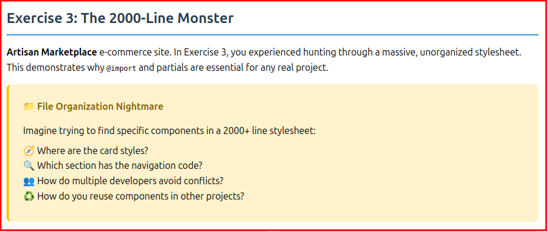

# LESS CSS Lab - E**Note:** Some files contain intentional errors that you'll fix during the exercises.

## Available Scripts

```bashse Instructions

This directory contains the hands-on exercises for learning LESS CSS preprocessor.

## Getting Started

1. **Install dependencies:**
   ```bash
   npm install
   ```

2. **Compile and run demo:**
   ```bash
   npm start
   ```

3. **Open `demo.html` in your browser** to see the results

> **Note:** Some files contain intentional errors that you'll fix during the exercises.

## � Available Scripts

```bash
npm run compile:ex1    # Compile exercise 1 only
npm run compile:ex2    # Compile exercise 2 only  
npm run compile:ex3    # Compile exercise 3 only
npm run compile:all    # Compile all exercises
npm run watch:less     # Watch for changes and auto-compile
npm start              # Compile all and prepare demo
```

## Exercise Instructions

### Exercise 1: Variables - The Color Nightmare
**File:** `exercises/exercise1.less`

**Scenario:** You're working on "Heritage Weavers" website. The client wants to change their brand color from terracotta to teal across the entire site.

**Your Task:**
1. First, manually find and change all color instances (feel the pain!)
2. Then, implement LESS variables to solve the maintenance nightmare
3. Use color functions like `darken()` and `lighten()` for variations

**Key Concepts:**
- LESS variable syntax: `@brand-color: #16a085;`
- Color functions: `darken(@brand-color, 10%)`
- Single source of truth for repeated values


---

### Exercise 2: Mixins - The Button Factory Hell
**File:** `exercises/exercise2.less`

**Scenario:** You work at "Pixel Perfect Design Agency" with dozens of button variations. Your boss wants to change ALL buttons to have rounded corners.

**Your Task:**
1. First, manually update border-radius across all button classes (experience the repetition!)
2. Then, create LESS mixins to eliminate the repetitive patterns
3. Use parameters and defaults for flexible reuse

**Key Concepts:**
- LESS mixin syntax: `.button-base(@color, @size)`
- Parameters with defaults: `@bg-color: @brand-color`
- Color functions for hover states: `darken(@bg-color, 10%)`


---

### Exercise 3: Partials - The 2000-Line Monster  
**File:** `exercises/exercise3.less`

**Scenario:** You've inherited CSS for "Artisan Marketplace". The previous developer put EVERYTHING in one massive file.

**Your Task:**
1. First, hunt through the monster stylesheet to find specific components (feel the frustration!)
2. Then, organize code into logical partials using `@import`
3. Create a maintainable file structure for team development

**Key Concepts:**
- File organization with `@import`
- Logical separation by component and purpose
- Professional stylesheet structure for teams



---

## Success Criteria

You'll know you've succeeded when:

✅ **Exercise 1:** You can change the entire site's color scheme by modifying one variable  
✅ **Exercise 2:** You can create new button variants in seconds using your mixins  
✅ **Exercise 3:** You can quickly find and modify any component in organized partials

## LESS vs SCSS Quick Reference

| Feature | LESS | SCSS |
|---------|------|------|
| Variables | `@color: blue;` | `$color: blue;` |
| Mixins | `.border-radius(@r) { }` | `@mixin border-radius($r) { }` |
| Using Mixins | `.border-radius(5px);` | `@include border-radius(5px);` |
| Interpolation | `@{variable}` | `#{$variable}` |
| Conditionals | `when (@a > 0)` | `@if $a > 0` |

## Debugging Tips

- Use `npm run compile:ex1` to compile individual exercises
- Check the terminal for LESS compilation errors
- Refresh `demo.html` after each compilation
- Use browser dev tools to inspect generated CSS

## What You're Learning

**The Problems CSS Preprocessors Solve:**
- Hard-coded values scattered everywhere create maintenance hell
- Repetitive CSS patterns lead to bloated, error-prone code  
- Unorganized stylesheets become impossible to navigate and maintain

**How LESS Solves These Problems:**
- **Variables** provide single source of truth for repeated values
- **Mixins** eliminate repetitive CSS patterns  
- **Partials** organize code into logical, maintainable files
- **Color Functions** create consistent variations automatically

---

**Need help?** Check the main project README for overview and additional resources.

## Quick Start

```bash
# Install dependencies
npm install

# Compile LESS to CSS
npm start
```

> Note that there are currently errors in some of the files -- these will be fixed as you go through the exercises.

## Why LESS?

LESS was one of the first CSS preprocessors and remains popular because:
- **Simpler syntax** - Closer to vanilla CSS, easier learning curve
- **Client-side compilation** - Can run in the browser during development (great for prototyping)
- **JavaScript integration** - Written in JavaScript, easy to extend with custom functions
- **Bootstrap legacy** - Bootstrap used LESS before switching to SCSS (many projects still use LESS)
- **Flexible approach** - Less opinionated than SCSS, multiple ways to solve problems

## LESS vs SCSS: Quick Reference

| Feature | LESS | SCSS |
|---------|------|------|
| Variables | `@color: blue;` | `$color: blue;` |
| Mixins | `.border-radius(@r) { }` | `@mixin border-radius($r) { }` |
| Using Mixins | `.border-radius(5px);` | `@include border-radius(5px);` |
| Interpolation | `@{variable}` | `#{$variable}` |
| Conditionals | `when (@a > 0)` | `@if $a > 0` |

---

## Exercise 1: The Color Nightmare


**🎯 Objective:** Experience the maintenance hell of repeated values, then solve with LESS variables.

### The Scenario
You're working on "Heritage Weavers" (a rug-making company) website. The client wants to change their brand color from terracotta to teal across their entire site. You'll discover why hard-coded color values create maintenance nightmares.

### What You'll Experience
1. **The Pain**: Manually find and change dozens of color instances across a stylesheet
2. **The Pattern Recognition**: Identify what makes this so error-prone and tedious
3. **The Solution**: Learn how LESS variables solve this exact problem
4. **The Magic**: Change one variable and watch the entire site update

### Key Learning Moments
- **Variables aren't just convenient** - they're essential for maintainable CSS
- **LESS syntax**: `@brand-color: #16a085;` vs SCSS's `$brand-color`
- **Color functions**: `darken(@brand-color, 10%)` for automatic variations
- **Single source of truth**: One place to update, everywhere changes


---

## Exercise 2: The Button Factory Hell

**🎯 Objective:** Feel the pain of repetitive CSS patterns, then solve with LESS mixins.

### The Scenario
You work at "Pixel Perfect Design Agency" with a component library containing dozens of button variations. Each button is 90% identical code with slight differences. Your boss wants to change ALL buttons to have rounded corners - good luck finding every instance!

### What You'll Experience
1. **The Tedium**: Manually update border-radius across 9+ nearly identical button classes
2. **The Repetition**: See how much duplicate code exists in "well-organized" CSS
3. **The Solution**: Learn how LESS mixins eliminate repetitive patterns
4. **The Power**: Create new button variants in seconds instead of minutes

### Key Learning Moments
- **Mixins solve repetition** - not just convenience, but essential for scalable CSS
- **LESS syntax**: `.button-base(@color, @size)` vs SCSS's `@mixin` and `@include`
- **Parameters with defaults**: `@bg-color: @brand-color` for flexible reuse
- **Color functions**: `darken(@bg-color, 10%)` for automatic hover states
- **Maintainability**: Change one mixin, update all buttons instantly


---

## Exercise 3: The 2000-Line Monster

**🎯 Objective:** Navigate unorganized stylesheet chaos, then solve with LESS partials.

### The Scenario
You've inherited the CSS for "Artisan Marketplace", a large e-commerce site. The previous developer put EVERYTHING in one massive file. Need to find the card component styles? Good luck scrolling through 2000+ lines looking for the right section!

### What You'll Experience
1. **The Search**: Hunt through a monster stylesheet to find one specific component
2. **The Frustration**: Realize how impossible large codebases become without organization
3. **The Solution**: Learn how LESS partials organize code into logical, manageable files
4. **The Structure**: See how professional projects organize stylesheets for teams

### Key Learning Moments
- **Partials aren't optional** - they're essential for any real project
- **@import**: How LESS combines separate files into one CSS output
- **File organization**: Logical separation by component, utility, and purpose
- **Team development**: How multiple developers work without conflicts
- **Reusability**: How organized partials enable component sharing across projects
- **Maintainability**: Finding specific styles in seconds instead of minutes


---

## What You've Learned

### The Problems CSS Preprocessors Solve
✅ **The Color Nightmare**: Hard-coded values scattered everywhere create maintenance hell  
✅ **The Button Factory**: Repetitive CSS patterns lead to bloated, error-prone code  
✅ **The 2000-Line Monster**: Unorganized stylesheets become impossible to navigate and maintain  

### How LESS Solves These Problems
✅ **Variables**: `@brand-color` provides single source of truth for repeated values  
✅ **Mixins**: `.button-base(@color, @size)` eliminates repetitive CSS patterns  
✅ **Partials**: `@import` organizes code into logical, maintainable files  
✅ **Color Functions**: `darken(@color, 10%)` creates consistent variations automatically  

### LESS vs SCSS Key Differences
✅ **Syntax**: LESS uses `@` for variables, simpler `.mixin()` syntax  
✅ **Philosophy**: LESS is more CSS-like and flexible, SCSS is more structured  
✅ **Functions**: Similar capabilities, slightly different syntax  

### When to Use Preprocessors (Any Preprocessor!)
**Preprocessors become essential when:**
- Your CSS file grows beyond ~200 lines
- Multiple developers work on the same styles
- You need consistent theming across a project
- You're repeating the same patterns multiple times
- You're building reusable component libraries

**Choose LESS specifically when:**
- Team prefers CSS-like syntax (easier learning curve)
- Working with Bootstrap-based projects (legacy compatibility)
- Need client-side compilation for rapid prototyping
- Want a more flexible, less opinionated approach

## Next Steps

If you have time remaining, explore the [LESS documentation](https://lesscss.org/#overview) for more features.
